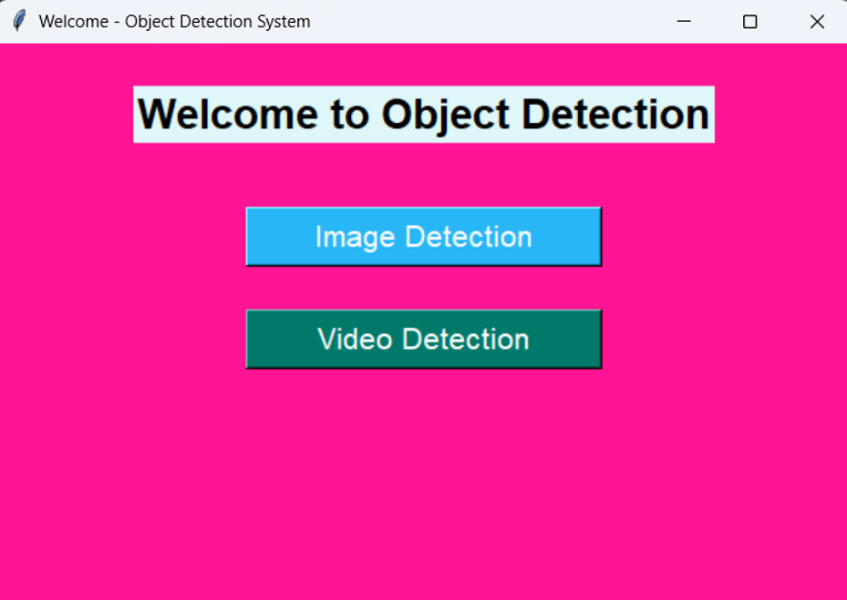
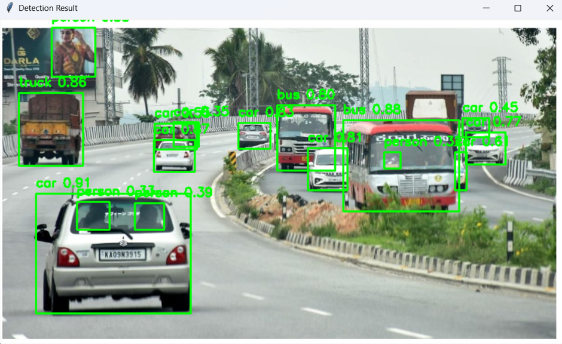
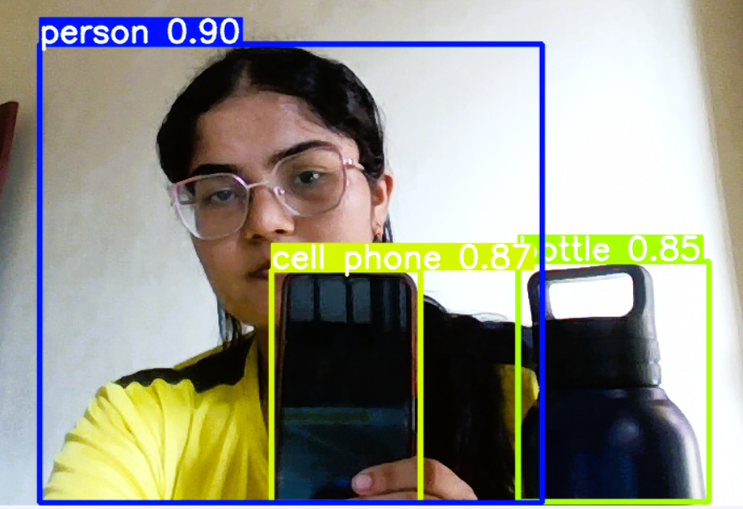

# Real-Time Object Detection System

## Overview

A Python-based Object Detection System using YOLOv5, OpenCV, and Tkinter.

## Features

* Image Object Detection
* Real-Time Webcam Object Detection
* User-Friendly GUI
* YOLOv5 Deep Learning Model

## Technologies Used

* Python
* OpenCV
* PyTorch
* YOLOv5
* Tkinter

## Project Structure

* main_frontend.py – Welcome Screen
* object_detection_gui.py – Video Detection GUI
* object_detection_backend.py – YOLOv5 Detection Backend

## Installation

pip install -r requirements.txt

## Run

python main_frontend.py

## Screenshots

### Welcome Screen

### Image Detection

### Video Detection

